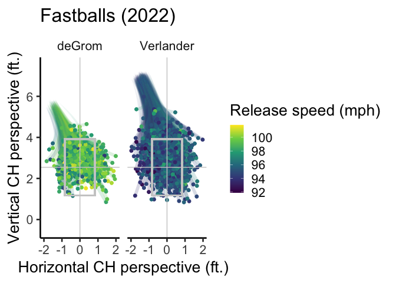

Pitch_Paths
================
2023-03-08

\#Pitch_Paths \##A markdown by BigLeagueBayes This markdown doc
demonstratres a method for plotting the paths of Statcast pitches
between release and the strikezone by applying splines to pitch
coordinates adjusted with horizontal and vertical movement. The goal of
these plots is to improve upon the three dimensional pitch paths
visualized on Baseball Savant, which rise and fall but don’t visualize
break and run.

\##Scrape Statcast data

The functions enable users to scrape a year’s worth of Statcast data
from Baseball Savant all at once, which is usually only permitted for a
couple weeks at a time. The functions were written by Bill Petti at:
<https://billpetti.github.io/2021-04-02-build-statcast-database-rstats-version-3.0/>

``` r
# Set scrape functions
# Create functions for extracting full seasons from BaseBall Savant

annual_statcast_query <- function(season) {
  
  dates <- seq.Date(as.Date(paste0(season, '-03-01')),
                    as.Date(paste0(season, '-12-01')), by = 'week')
  
  date_grid <- tibble(start_date = dates, 
                      end_date = dates + 6)
  
  safe_savant <- safely(scrape_statcast_savant)
  
  payload <- map(.x = seq_along(date_grid$start_date), 
                 ~{message(paste0('\nScraping week of ', date_grid$start_date[.x], '...\n'))
                   
                   payload <- safe_savant(start_date = date_grid$start_date[.x], 
                                          end_date = date_grid$end_date[.x], type = 'pitcher')
                   
                   return(payload)
                 })
  
  payload_df <- map(payload, 'result')
  
  number_rows <- map_df(.x = seq_along(payload_df), 
                        ~{number_rows <- tibble(week = .x, 
                                                number_rows = length(payload_df[[.x]]$game_date))}) %>%
    filter(number_rows > 0) %>%
    pull(week)
  
  payload_df_reduced <- payload_df[number_rows]
  
  combined <- payload_df_reduced %>%
    bind_rows()
  
  return(combined)
  
}

format_append_statcast <- function(df) {
  
  # function for appending new variables to the data set
  
  additional_info <- function(df) {
    
    # apply additional coding for custom variables
    
    df$hit_type <- with(df, ifelse(type == "X" & events == "single", 1,
                                   ifelse(type == "X" & events == "double", 2,
                                          ifelse(type == "X" & events == "triple", 3, 
                                                 ifelse(type == "X" & events == "home_run", 4, NA)))))
    
    df$hit <- with(df, ifelse(type == "X" & events == "single", 1,
                              ifelse(type == "X" & events == "double", 1,
                                     ifelse(type == "X" & events == "triple", 1, 
                                            ifelse(type == "X" & events == "home_run", 1, NA)))))
    
    df$fielding_team <- with(df, ifelse(inning_topbot == "Bot", away_team, home_team))
    
    df$batting_team <- with(df, ifelse(inning_topbot == "Bot", home_team, away_team))
    
    df <- df %>%
      mutate(barrel = ifelse(launch_angle <= 50 & launch_speed >= 98 & launch_speed * 1.5 - launch_angle >= 117 & launch_speed + launch_angle >= 124, 1, 0))
    
    df <- df %>%
      mutate(spray_angle = round(
        (atan(
          (hc_x-125.42)/(198.27-hc_y)
        )*180/pi*.75)
        ,1)
      )
    
    df <- df %>%
      filter(!is.na(game_year))
    
    return(df)
  }
  
  df <- df %>%
    additional_info()
  
  df$game_date <- as.character(df$game_date)
  
  df <- df %>%
    arrange(game_date)
  
  df <- df %>%
    filter(!is.na(game_date))
  
  df <- df %>%
    ungroup()
  
  df <- df %>%
    select(setdiff(names(.), c("error")))
  
  cols_to_transform <- c("fielder_2", "pitcher_1", "fielder_2_1", "fielder_3",
                         "fielder_4", "fielder_5", "fielder_6", "fielder_7",
                         "fielder_8", "fielder_9")
  
  df <- df %>%
    mutate_at(.vars = cols_to_transform, as.numeric) %>%
    mutate_at(.vars = cols_to_transform, function(x) {
      ifelse(is.na(x), 999999999, x)
    })
  
  data_base_column_types <- read_csv("https://app.box.com/shared/static/q326nuker938n2nduy81au67s2pf9a3j.csv")
  
  character_columns <- data_base_column_types %>%
    filter(class == "character") %>%
    pull(variable)
  
  numeric_columns <- data_base_column_types %>%
    filter(class == "numeric") %>%
    pull(variable)
  
  integer_columns <- data_base_column_types %>%
    filter(class == "integer") %>%
    pull(variable)
  
  df <- df %>%
    mutate_if(names(df) %in% character_columns, as.character) %>%
    mutate_if(names(df) %in% numeric_columns, as.numeric) %>%
    mutate_if(names(df) %in% integer_columns, as.integer)
   
  return(df)
}

delete_and_upload <- function(df, 
                              year, 
                              db_driver = "PostgreSQL", 
                              dbname, 
                              user, 
                              password, 
                              host = 'local_host', 
                              port = 5432) {
  
  pg <- dbDriver(db_driver)
  
  statcast_db <- dbConnect(pg, 
                           dbname = dbname, 
                           user = user, 
                           password = password,
                           host = host, 
                           port = posrt)
  
  query <- paste0('DELETE from statcast where game_year = ', year)
  
  dbGetQuery(statcast_db, query)
  
  dbWriteTable(statcast_db, "statcast", df, append = TRUE)
  
  dbDisconnect(statcast_db)
  rm(statcast_db)
}
```

Extract your data. In our case, we’ll extract from the 2022 spring
training + regular season.

``` r
# Extract statcast data (time = 32 minutes)
payload_statcast_2022 <- annual_statcast_query(2022)
 
sc_2022_df <- format_append_statcast(df = payload_statcast_2022)

# Save 2022 stacast data
save(sc_2022_df, file = "sc_2022_df.RData")
```

\#Wrangle pitch data

We need to a dataframe containing three sets of coordinates per pitch:
its release point (release_pos_x/z), strike zone coordinate (plate_x/z),
and the strike zone coordinate adjusted for vertical and horizontal
movement (pfx_x/z). As an example of these plots, and because I’m a Mets
fan interested in the Verlander-for-deGrom “repalcement”, we’ll compare
pitches from 2022 Justin Verlander and Jacob deGrom.

``` r
# Load 2022 data
load("sc_2022_df.RData")

sc_2022_df <- as.data.frame(sc_2022_df)

# Filter for Mets in pitching statcast data
name_index <- data.frame(pitcher = c(594798, 434378),
                         name = c("deGrom",  "Verlander"))

sc_p_NYM_df <- filter(sc_2022_df, pitcher %in% c(594798, 434378))

# Add pitcher name to filtered df
sc_p_NYM_df <- merge(sc_p_NYM_df,
                     name_index,
                     by = "pitcher")

# Create whiff metric (swings and misses vs. swings and contact)
sc_p_NYM_df$whiff <- ifelse(sc_p_NYM_df$type %in% c("B", "X") | sc_p_NYM_df$description == "foul", 0, 1)

# Calculate mean whiff for sliders
whiff_means <- summarySE(measurevar = "whiff",
          groupvars = c(),
          data = filter(sc_p_NYM_df, pitch_type == "SL"))

# Calculate mean lateral position in strikezone for sliders
plate_x_means <- summarySE(measurevar = c("plate_x"),
                      groupvars = c("name"),
                      data = filter(sc_p_NYM_df, pitch_type == "SL" & 
                                      name %in% c("deGrom", "Verlander")))

# Create a data frame of averages for lateral distance off the plate
avg_SL_df <- data.frame(name = c("deGrom", "Verlander"),
                        plate_x = c(0.6678788, 0.5126593),
                        whiff = c(0.5454545, 0.3434903),
                        label = c("deGrom Avg.", "Verlander Avg."))
```

\##Plotting

We’ll start with plots of Verlander and deGrom’s slider

``` r
# Plot slider whiff across lateral distance from plate
Verlandervs_deGrom_prob <- ggplot(data = filter(sc_p_NYM_df, pitch_type == "SL" & 
                                                  name %in% c("deGrom", "Verlander") &
                                                  !type == "B" & !description == "called_strike"),
                                  aes(x = plate_x, y = whiff, color = name, group = name, fill = name)) +
  geom_smooth(method="glm", fullrange = TRUE,
              method.args=list(family = "binomial"), alpha = 0.5) +
  geom_point(data = avg_SL_df, size = 5, color = "white") +
  geom_point(data = avg_SL_df, size = 3) +
  ggrepel::geom_label_repel(data = avg_SL_df, aes(label = label), 
                            fill = "white", size = 4, force = 10, nudge_y = .37) +
  theme_classic(base_size = 20, base_rect_size = 0) +
  theme(legend.position = "none") +
  scale_color_viridis_d(direction = -1, begin =.25, end = .75) +
  scale_fill_viridis_d(direction = -1, begin = .25, end = .75) +
  labs(y = "Whiff rate", x = "Lateral distance from plate (ft.)", 
       title = "Whose SL was less touchable?",
       subtitle = "2022",
       color = "Pitcher", fill = "Pitcher")

# Show plot
Verlandervs_deGrom_prob
```

    ## `geom_smooth()` using formula = 'y ~ x'

<!-- -->

``` r
# Create data frame of pitch trajectories
# First, create an id for each pitch
sc_p_NYM_df$pitch_ID <- paste(sc_p_NYM_df$game_date,
                               sc_p_NYM_df$pitcher,
                               sc_p_NYM_df$release_pos_x,
                               sc_p_NYM_df$release_pos_z,
                               sep = "_")

pitch_traj_df <- rbind(
  data.frame(pitch_ID = sc_p_NYM_df$pitch_ID, # Release coordinate
             pitch_type = sc_p_NYM_df$pitch_type,
             pitcher = sc_p_NYM_df$pitcher,
             release_speed = sc_p_NYM_df$release_speed,
             release_spin_rate = sc_p_NYM_df$release_spin_rate,
             class = "a",
             x_coord = sc_p_NYM_df$release_pos_x,
             y_coord = sc_p_NYM_df$release_pos_z,
             type = sc_p_NYM_df$type,
             name = sc_p_NYM_df$name),
      data.frame(pitch_ID = sc_p_NYM_df$pitch_ID, # Plate coord + vertical and horizontal break coordinate
             pitch_type = sc_p_NYM_df$pitch_type,
             pitcher = sc_p_NYM_df$pitcher,
             release_speed = sc_p_NYM_df$release_speed,
             release_spin_rate = sc_p_NYM_df$release_spin_rate,
             class = "b",
             x_coord = sc_p_NYM_df$plate_x - (sc_p_NYM_df$pfx_x - (sc_p_NYM_df$release_pos_x - sc_p_NYM_df$plate_x)),
             y_coord = sc_p_NYM_df$plate_z - (sc_p_NYM_df$pfx_z - (sc_p_NYM_df$release_pos_z - sc_p_NYM_df$plate_z)),
             type = sc_p_NYM_df$type,
             name = sc_p_NYM_df$name),
  data.frame(pitch_ID = sc_p_NYM_df$pitch_ID, # Plate coordinate
             pitch_type = sc_p_NYM_df$pitch_type,
             pitcher = sc_p_NYM_df$pitcher,
             release_speed = sc_p_NYM_df$release_speed,
             release_spin_rate = sc_p_NYM_df$release_spin_rate,
             class = "c",
             x_coord = sc_p_NYM_df$plate_x,
             y_coord = sc_p_NYM_df$plate_z,
             type = sc_p_NYM_df$type,
             name = sc_p_NYM_df$name)
)

# Plot path of slider
Verlandervs_deGrom <- 
  ggplot(data = filter(pitch_traj_df, pitch_type == "SL" & name %in% c("Verlander", "deGrom")),
       aes(group = pitch_ID)) +
  geom_bspline(aes(x = x_coord, y = y_coord, group = pitch_ID, color = release_speed,
                   alpha = stat(index), size = after_stat(index)), type = "clamped") + 
  geom_point(data = filter(pitch_traj_df, pitch_type == "SL" & name %in% c("Verlander", "deGrom") & class == "c"),
             aes(x = x_coord, y = y_coord, size = .75, color = release_speed)) +
  geom_rect(aes(xmin=-0.83, xmax=0.83, ymin=3.92, ymax=1.17), fill = "grey80", alpha = .0, color = "gray80", size = 1) +
  geom_hline(yintercept = 1.17 + ((3.92 - 1.17)/2), color = "gray80", size = .5) +
  geom_vline(xintercept = 0, color = "gray80", size = .5) +
  facet_wrap(~name) +
  scale_color_viridis_c() +
  scale_alpha_continuous(range = c(0.05, 0.2)) +
  scale_size_continuous(range = c(0, 2)) +
  theme_classic(base_size = 20, base_rect_size = 0) +
  scale_x_continuous(limits = c(-2,2)) +
  scale_y_continuous(limits = c(-0.5,7.5)) +
  labs(title = "Sliders (2022)", 
       y = "Vertical CH perspective (ft.)", 
       x = "Horizontal CH perspective (ft.)", 
       color = "Release speed (mph)")+
  guides(size = "none", alpha = "none")
```

    ## Warning: Using `size` aesthetic for lines was deprecated in ggplot2 3.4.0.
    ## ℹ Please use `linewidth` instead.

``` r
# Show plot
Verlandervs_deGrom
```

    ## Warning: `stat(index)` was deprecated in ggplot2 3.4.0.
    ## ℹ Please use `after_stat(index)` instead.

    ## Warning: Removed 34005 rows containing missing values (`geom_path()`).

    ## Warning: Removed 15 rows containing missing values (`geom_point()`).

<!-- -->

Next, we’ll look at their fastballs

``` r
# Estimate mean FF release speed
pfx_x_means_FF <- summarySE(measurevar = c("release_speed"),
                      groupvars = c("name"),
                      data = filter(sc_p_NYM_df, pitch_type == "FF" & name %in% c("deGrom", "Verlander") 
                                    & !type == "B" & !description == "called_strike"))

# Estimate mean FF whiff
whiff_means_FF <- summarySE(measurevar = c("whiff"),
                      groupvars = c("name"),
                      data = filter(sc_p_NYM_df, pitch_type == "FF" & name %in% c("deGrom", "Verlander") 
                                    & !type == "B" & !description == "called_strike"))

# Create dataframe of mean release speeds and whiffs
avg_FF_df <- data.frame(name = c("deGrom", "Verlander"),
                        release_speed = c(99.02113, 95.23276),
                        whiff = c(0.3028169, 0.1888412),
                        label = c("deGrom Avg.", "Verlander Avg."))

# Plot whiff across release speed
Verlandervs_deGrom_FF_prob <- ggplot(data = filter(sc_p_NYM_df, pitch_type == "FF" & name %in% c("deGrom", "Verlander") &
                                                  !type == "B" & !description == "called_strike"),
       aes(x = release_speed, y = whiff, color = name, group = name, fill = name)) +
  geom_smooth(method="glm", fullrange = TRUE,
    method.args=list(family = "binomial"), alpha = 0.5) +
  #geom_point(alpha = 0.25) +
  geom_point(data = avg_FF_df, size = 5, color = "white") +
  geom_point(data = avg_FF_df, size = 3) +
  ggrepel::geom_label_repel(data = avg_FF_df, aes(label = label), fill = "white", size = 4, force = 10, nudge_y = .37) +
  theme_classic(base_size = 20, base_rect_size = 0) +
  theme(legend.position = "none") +
  scale_color_viridis_d(direction = -1, begin =.25, end = .75) +
  scale_fill_viridis_d(direction = -1, begin = .25, end = .75) +
  labs(y = "Whiff rate", x = "Release speed (mph)", 
       title = "Whose FF was less touchable?",
       subtitle = "2022",
       color = "Pitcher", fill = "Pitcher")

Verlandervs_deGrom_FF_prob
```

    ## `geom_smooth()` using formula = 'y ~ x'

<!-- -->

``` r
Verlandervs_deGrom_FF <- 
  ggplot(data = filter(pitch_traj_df, pitch_type == "FF" & name %in% c("Verlander", "deGrom")),
       aes(group = pitch_ID)) +
  geom_bspline(aes(x = x_coord, y = y_coord, group = pitch_ID, color = release_speed,
                   alpha = stat(index), size = after_stat(index)), type = "clamped") + 
  geom_point(data = filter(pitch_traj_df, pitch_type == "FF" & name %in% c("deGrom", "Verlander") & class == "c"),
             aes(x = x_coord, y = y_coord, size = .75, color = release_speed)) +
  geom_rect(aes(xmin=-0.83, xmax=0.83, ymin=3.92, ymax=1.17), fill = "grey80", alpha = .0, color = "gray80", size = 1) +
  geom_hline(yintercept = 1.17 + ((3.92 - 1.17)/2), color = "gray80", size = .5) +
  geom_vline(xintercept = 0, color = "gray80", size = .5) +
  facet_wrap(~name) +
  scale_color_viridis_c() +
  scale_alpha_continuous(range = c(0.05, 0.2)) +
  scale_size_continuous(range = c(0, 2)) +
  theme_classic(base_size = 20, base_rect_size = 0) +
  scale_x_continuous(limits = c(-2,2)) +
  scale_y_continuous(limits = c(-0.5,7.5)) +
  labs(title = "Fastballs (2022)", 
       y = "Vertical CH perspective (ft.)", 
       x = "Horizontal CH perspective (ft.)", 
       color = "Release speed (mph)")+
  guides(size = "none", alpha = "none")

# Show plot
Verlandervs_deGrom_FF
```

    ## Warning: Removed 598 rows containing missing values (`geom_path()`).

    ## Warning: Removed 4 rows containing missing values (`geom_point()`).

<!-- -->

``` r
# Arrange slider v fastball panel
SL_FF_panel <- ggarrange( Verlandervs_deGrom_prob, Verlandervs_deGrom, Verlandervs_deGrom_FF_prob, Verlandervs_deGrom_FF, 
                    labels = NA,
                    widths = c( .6, 1, .6, 1 ),
                    ncol = 2, nrow = 2, align = "v" )
```

    ## `geom_smooth()` using formula = 'y ~ x'

    ## Warning: Removed 34005 rows containing missing values (`geom_path()`).

    ## Warning: Removed 15 rows containing missing values (`geom_point()`).

    ## `geom_smooth()` using formula = 'y ~ x'

    ## Warning: Removed 598 rows containing missing values (`geom_path()`).

    ## Warning: Removed 4 rows containing missing values (`geom_point()`).

    ## Warning: Graphs cannot be vertically aligned unless the axis parameter is set.
    ## Placing graphs unaligned.

``` r
# Export panel
png("SL_FF_panel.png", units = "in", width = 16, 
      height = 12, 
      res = 600 )

SL_FF_panel
```

    ## Warning: Removed 1 rows containing missing values (`geom_text()`).

``` r
dev.off()
```

    ## quartz_off_screen 
    ##                 2
